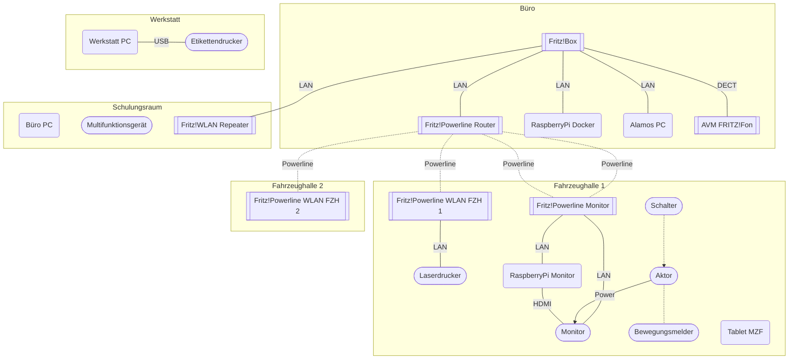

# Überblick

Diese folgenden Seiten bieten einen Überblick über die Hardware, welche im Feuerwehrhaus betrieben wird.

## Geräteplan

```mermaid
graph TD

    subgraph buero[Büro]
        router[[Fritz!Box]]
        pwl-rt[[Fritz!Powerline Router]]
        rpidoc(RaspberryPi Docker)
        fe2pc(Alamos PC)
        phone[[AVM FRITZ!Fon]]
        
        router---|LAN|pwl-rt
        router---|LAN|rpidoc
        router---|LAN|fe2pc
        router---|DECT|phone
    end
    
    subgraph schulungsraum[Schulungsraum]
        bueropc(Büro PC)
        copier([Multifunktionsgerät])
        wlanrep[[Fritz!WLAN Repeater]]
        router---|LAN|wlanrep
    end
    
    subgraph werkstatt[Werkstatt]
        fmpc(Werkstatt PC)
        labelprinter([Etikettendrucker])
        
        fmpc---|USB|labelprinter
    end
    
    subgraph fzh1[Fahrzeughalle 1]
        pwl-fzh1[[Fritz!Powerline WLAN FZH 1]]
        pwl-mon[[Fritz!Powerline Monitor]]
        printer([Laserdrucker])
        monitor([Monitor])
        actor([Aktor])
        motion([Bewegungsmelder])
        plug([Schalter])
        rpimon(RaspberryPi Monitor)
        tablet(Tablet MZF)

       %% router---pwl-fzh1
       %% router---pwl-fzh2
       %% router---pwl-mon

        pwl-fzh1---|LAN|printer
        
        pwl-mon---|LAN|monitor
        pwl-mon---|LAN|rpimon
        
        plug-.->actor--Power-->monitor
        rpimon---|HDMI|monitor
        actor-.-motion

    end
    
    subgraph fzh2[Fahrzeughalle 2]
        pwl-fzh2[[Fritz!Powerline WLAN FZH 2]]
    end
    
    pwl-rt-.-|Powerline|pwl-mon
    pwl-rt-.-|Powerline|pwl-fzh1
    pwl-rt-.-|Powerline|pwl-fzh2
    pwl-rt-.-|Powerline|pwl-mon
    
```